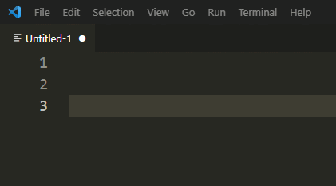

# WordPress block markup

The WordPress block markup extension includes autocomplete snippets that helps you add blocks to your templates faster.

## Features

Add blocks to your full site editing templates faster by typing the name of the block.

For example, to add a template part, start typing "wp:template-part" or just "template part":

## Release Notes

### 1.0.0

Initial release of WordPress block markup.
Gutenberg version: 10.6 RC1.

## License

GPL 2.0 or later
